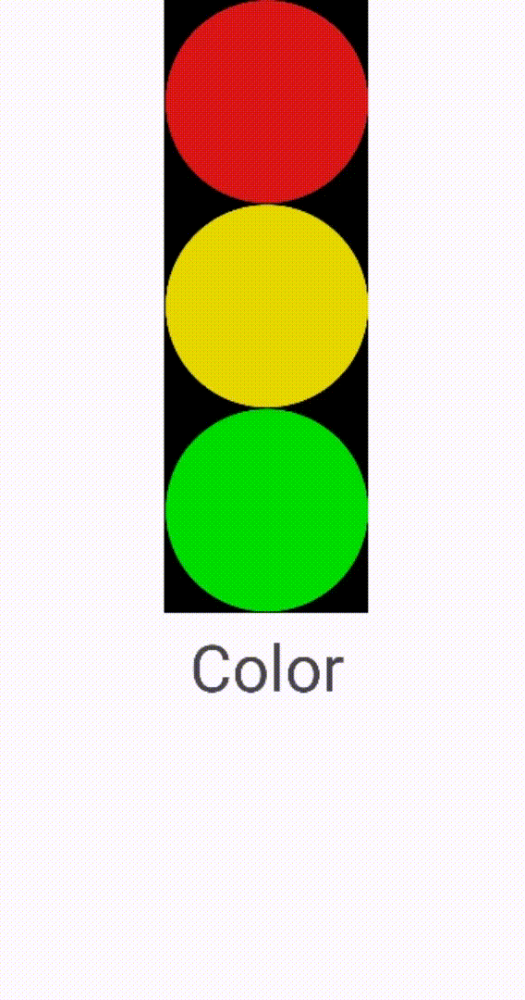

Language : us | [ru](./README.ru-RU.md)

# Traffic Lights
This is my traffic light program. The program has 3 buttons with pictures of 3 circles and when you click on any of the buttons, the background color changes

<h2 align="center">Compatibility</h2>  

| </br>Android | </br>Apple |
:-------:|:-------:|
|    ✔️  |    ❌  |

 

<h1 align="center">Important code moments</h1> 

In this project, instead of using a `Button`, I used `ImageButton`. This made it possible to insert an image into the button

The main code is Java. The code is quite simple, there is only one point

```
redButton.setOnClickListener(new View.OnClickListener() {
            public void onClick(View view) {
                mainLayout.setBackgroundColor(Color.RED);
                textView.setText("Red");
            }
        });
```
This is an example of using an `event handler`. In this case, it simply changes the appearance of the application interface in response to user actions
