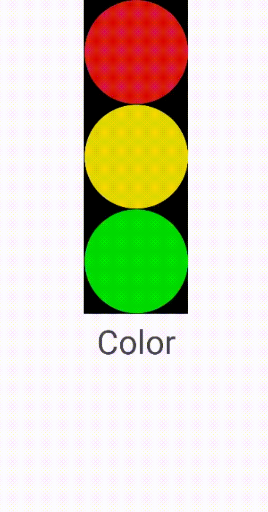

Язык : [us](./README.md) | ru

# Светофор
Это моя программа `Светофор`. В программе есть 3 кнопки с изображениями 3 кругов, и когда вы нажимаете на любую из кнопок, цвет фона меняется

<h2 align="center">Совместимость</h2>  

| </br>Android | </br>Apple |
:-------:|:-------:|
|    ✔️  |    ❌  |

 

<h1 align="center">Важные моменты кода</h1> 

В этом проекте вместо использования `Button` я использовал `ImageButton`. Это позволило вставить изображение в кнопку

Основной код - Java. Код довольно прост, есть только один момент

```
redButton.setOnClickListener(new View.OnClickListener() {
            public void onClick(View view) {
                mainLayout.setBackgroundColor(Color.RED);
                textView.setText("Red");
            }
        });
```
Это пример использования "обработчика событий". В данном случае он просто изменяет внешний вид интерфейса приложения в ответ на действия пользователя
